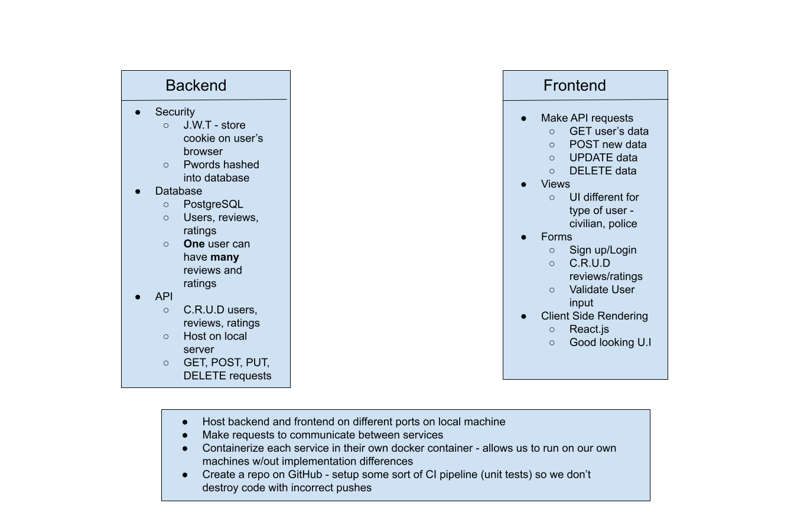

# Sirate
Enhancing trust between communities and police

## Setup
 - Install Node.js
 - Install Docker
 - run ```npm install``` in directory (right now just backend) to download all dependencies
 - All backend work should be done in the **backend** directory and all frontend work should be done in the **frontend** directory

### Potential Web App Architecture:



### Todos:
- []
 